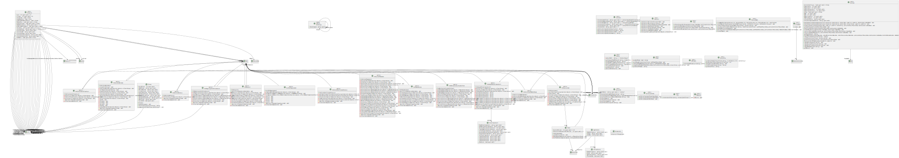
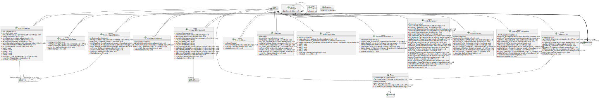
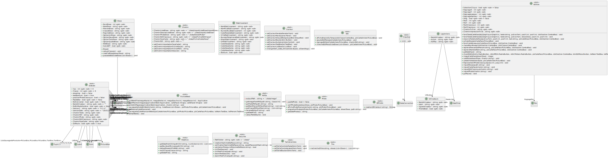
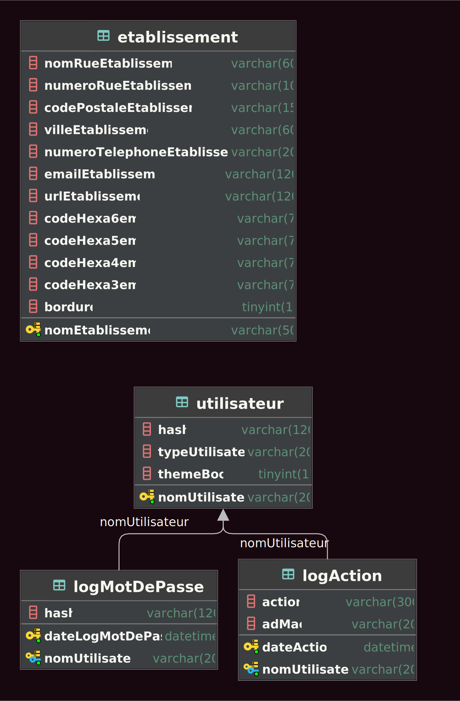
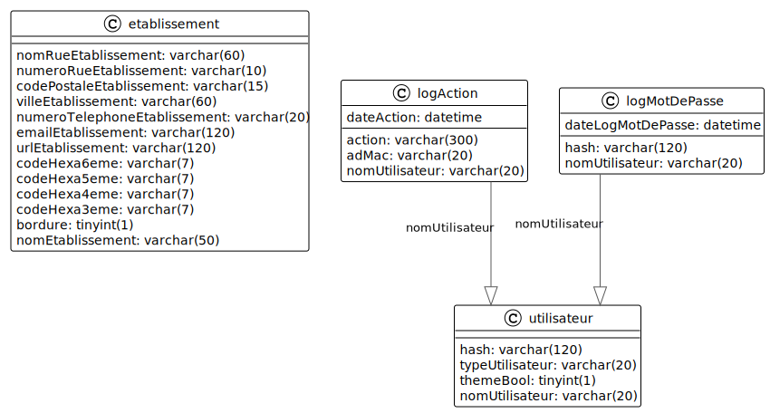
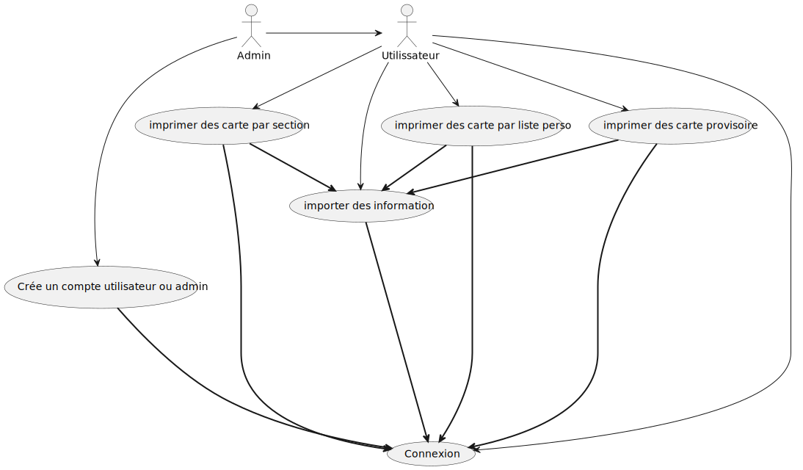

# appStage 

pour pouvoir utiliser l'application il faut suivre les étapes suivantes :

- [Activer la virtualisation](./file/pdf/Activer_la_virtualisation.pdf)
- [Installation de la base de donnée](./file/pdf/Mise_en_place_BDD__WinSCP__Script.pdf)
- [Configuration de l'application](./file/pdf/Guide_dinstallation_Carte_Acces_-_SysAdmin.pdf)
- [Guide d'utilisation](./file/pdf/Guide_de_lutilisateur_v1_-_06.02.2023.pdf)

## uml des classe

## uml et mcd de la bdd

## uml des cas d'utilisation

Repos de l'application de création de cartes d'accès   

TO DO :

- acheter un cerveau a David introuvable (Attendre le black friday)

- ne pas oublier ghostscript lol, pour import emploi temps lol ^^" xd (Merci David) 

POUR LE RAPPORT DE STAGE :

- un diagramme de cas d’utilisation, (IAN FAIT)
- une analyse RGPD, (DAVID A FAIRE)
- rédaction un guide de l'utilisateur (DAVID EN COURS)
- réaliser une vidéo de présentation de l'application (DAVID A FAIRE)
- rédaction la documentation pour la base de données (DAVID FAIT)
- rédaction du guide pour le SysAdmin (DAVID FAIT)
- rédaction du cahier des charges (DAVID A FAIRE)
- rédaction la documentation technique de l'application (DAVID, IAN, YANN A FAIRE)
- lister et documenter les référentiels utilisés dans votre entreprise (DAVID A FAIRE)
- rédaction rapide de versionning et gestion de projet (DAVID A FAIRE)
- présentez la mise en œuvre de la sécurité (B3/CEJMA) pour votre solution, (YANN FAIT)
- une analyse de l’impact environnemental / informatique verte (IAN)
- une analyse des coûts, des délais, des calculs. (YANN)
- mcd, uml diagramme de classe (fait)
- (utilisable pour l’épreuve B1/E4 en lien avec le portefeuille)

BUG :
 - le déchiffrement casse les images et ne supprime pas celles qui sont chiffrées

https://gist.github.com/cuonggt/9b7d08a597b167299f0d

---
 
# Prérequis
- serveur où installer virtualbox
- les droits d'administrateur sur le serveur
- 1go de ram disponible pour la machine virtuelle
- 10go d'espace disque disponible pour la machine virtuelle

# Installation

1. Télecharcher [virtualbox](https://www.virtualbox.org/) ensuite télecharger le fichier ova [ici]()
2. Ouvrer le fichier OVA avec virtualbox 
3. Lancer la machine virtuelle
4. Se connecter avec les identifiants suivants : 
    - login : slam2
    - password : kreyder
5. veuilleur changer le mot de passe de l'utilisateur voire creer un nouvel utilisateur
6. Se connecter a la base de donnée avec les identifiants suivants :
    - sudo mariadb
    - ou mariadb -u admin_user -p 
    - password : kreyderslam2! 
7. creer un nouvelle utilisateur ayant les permissions sur la base de donnée
   - CREATE USER 'new_user'@'%' IDENTIFIED BY 'password';
   - GRANT ALL PRIVILEGES ON stage.* TO 'new_user'@'%';
   - FLUSH PRIVILEGES;
   - exit
   - n'oublier pas changer new_user et password par les identifiants de votre utilisateur
8. Télecharger l'application [ici]()
9. Decompresser l'archive sur le poste client 
10. Ouvrir le fichier config.xml et modifier l'ip trouvable avec la commande ip a ou sur le dchp de l'etablissement
    - ne pas oublier de modifier le port si celui-ci est different de 3306
    - ne pas oublier de mettre l'ip du serveur en statique via le dchp de l'etablissement ou via le fichier /etc/netplan/60-static.yaml
11. ouvrer l'application et connecter vous
    - login : keyuser
    - password : keuser
12. dans importation creer un nouvelle utilisateur ou changer le mot de passe de l'utilisateur keyuser
13. vous pouvez maintenant utiliser l'application et la distribuer a vos utilisateurs en leur creant un compte utilisateur
    - ne pas donner de compte administrateur a vos utilisateurs sauf si il y a un besoin particulier
    - les prerequis pour les mots de passe son 1 majuscule, 1 minuscule, 1 chiffre, 1 caractere special et 12 caracteres minimum
