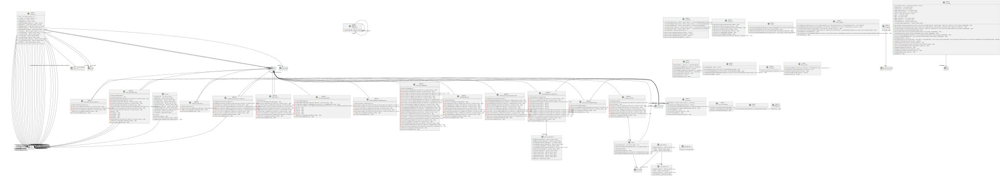

# appStage 

pour pouvoir utiliser l'application il faut suivre les étapes suivantes :

- [Activer la virtualisation](./file/pdf/Activer_la_virtualisation.pdf)
- [Installation de la base de donnée](./file/pdf/Mise_en_place_BDD__WinSCP__Script.pdf)
- [Configuration de l'application](./file/pdf/Guide_d'installation_Carte_Accès_-_SysAdmin_-_16.02.2023.pdf)
- [Guide d'utilisation](./file/pdf/Guide_de_l'utilisateur_-_16.02.2023.pdf)

## uml des classe

## uml et mcd de la bdd

## uml des cas d'utilisation

---
---
---

POUR LE RAPPORT DE STAGE :

- un diagramme de cas d’utilisation, (IAN FAIT)
- une analyse RGPD, (DAVID FAIT)
- rédaction un guide de l'utilisateur (DAVID FAIT)
- rédaction la documentation pour la base de données (DAVID FAIT)
- rédaction du guide pour le SysAdmin (DAVID FAIT)
- rédaction du cahier des charges fonctionnelles et techniques (DAVID FAIT)
- lister et documenter les référentiels utilisés dans votre entreprise (IAN FAIT)
- présentez la mise en œuvre de la sécurité (B3/CEJMA) pour votre solution, (YANN FAIT)
- une analyse de l’impact environnemental / informatique verte (IAN FAIT)
- une analyse des coûts, des délais, des calculs. (DAVID FAIT)
- mcd, uml diagramme de classe (fait)
- rédaction rapide de versionning et gestion de projet (DAVID EN COURS)
- rédaction la documentation technique de l'application (DAVID, IAN, YANN A FAIRE)
- réaliser une vidéo de présentation de l'application (DAVID ABANDON)
- (utilisable pour l’épreuve B1/E4 en lien avec le portefeuille)
